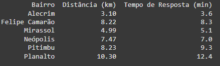
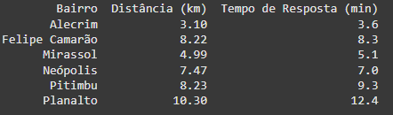
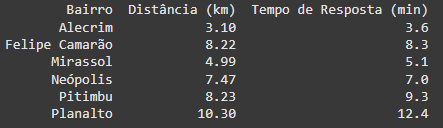
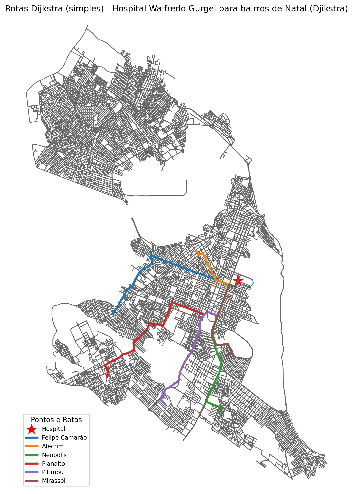
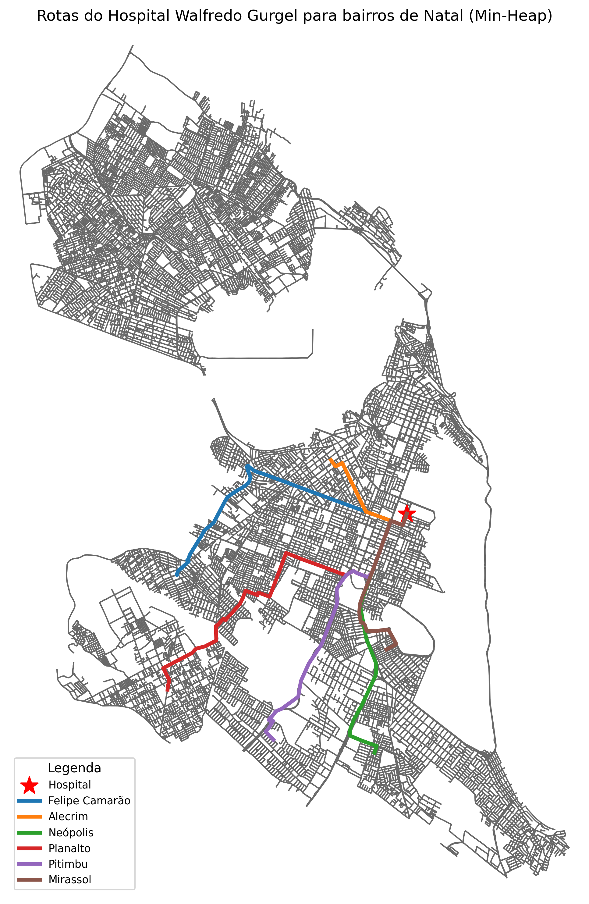
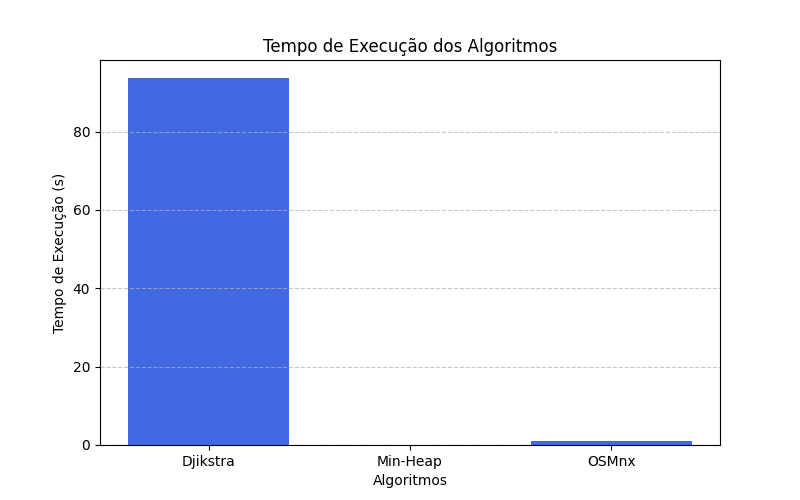
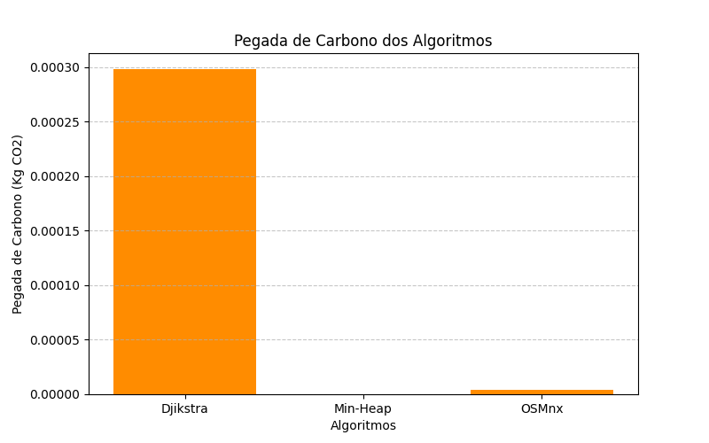

# U2_T1_ShortestPath
Repositório criado para o primeiro projeto da segunda unidade da disciplina AED II 

# Roteamento para Serviços de Emergência

## Alunos
- Gustavo Pereira de Carvalho  
- Matheus Bezerra Dantas Saraiva

---

## Descrição do Projeto

A atividade realizada neste repositório tem como objetivo avaliar o tempo de resposta de ambulâncias saindo do Hospital Monsenhor Walfredo Gurgel para diferentes bairros de Natal-RN. Considerando o uso de diferentes algoritmos para encontrar o melhor caminho, como Dijkstra, Dijkstra com Min-Heap e funções da biblioteca OSMnx.

A biblioteca **codeCarbon** também foi utilizada nesse projeto, a fim de medir as emissões de CO₂ causadas pela execução de cada algoritmo.

---

## OSMnx

A biblioteca OSM é utilizada para baixar dados de mapas do Open Street Maps (OSM), criando grafos de redes viárias, como ruas, estradas, ciclovias, etc. Além disso, o OSMnx possui funções que permitem calcular rotas, distâncias e analisar a acessibilidade urbana. Sendo assim, é possível utilizar a propriedade da organização do OSM em grafos para aplicarmos diferentes algoritmos para encontrar rotas, como no caso de Dijkstra e Min-Heap.

Além de servir como fonte para a base de dados dos programas utilizando Dijkstra e Min-Heap, o OSM também foi testado utilizando suas próprias funções e comparado com os demais algoritmos.

---

## Algoritmos Utilizados

### Dijkstra

O primeiro algoritmo testado foi o algoritmo de Dijkstra, utilizado para encontrar o caminho mínimo entre dois pontos de um grafo ponderado. Nesse caso, Dijkstra inicia no nó de origem (Hospital) e a cada passo escolhe o nó que é visitado mais próximo, atualizando a distância dos vizinhos ao encontrar um caminho mais curto, até chegar ao destino ou visitar todos os nós.

### Dijkstra com Min-Heap

O Min-Heap é aplicado junto do Dijkstra com o objetivo de acelerar o algoritmo. O Min-Heap é uma estrutura de dados que organiza os elementos por prioridade (menor valor no topo) na forma de uma árvore binária, permitindo ao Dijkstra encontrar o menor valor mais rapidamente.

---

## Medição de Emissões com codeCarbon

A biblioteca **codeCarbon** também foi utilizada para medir as emissões de CO₂ causadas pela execução de cada algoritmo, medindo o uso de memória RAM e CPU, retornando uma medida de emissão em Kg de CO₂.

---

## Implementação

Os códigos para implantação de cada algoritmo foram feitos utilizando a linguagem **Python**, com o auxílio do modelo de LLM **ChatGPT 4.0**. Mais detalhes sobre o uso da ferramenta de LLM estão disponíveis no arquivo `LLM.md`.

---

## Bairros Testados

Os bairros escolhidos para os testes foram:
- Neópolis
- Planalto
- Pitimbu
- Mirassol
- Felipe Camarão
- Alecrim

Esses bairros foram selecionados considerando o número de habitantes e fluxo de pessoas.

---

## Resultados Visuais

### Saídas dos Algoritmos

-   
  **Figura 1** - Saída do algoritmo de Dijkstra

-   
  **Figura 2** - Saída do algoritmo de Dijkstra com Min-Heap

-   
  **Figura 3** - Saída utilizando funções do OSMnx

### Rotas Geradas

Analisando brevemente as saídas dos programas é possível notar que todos tiveram resultados parecidos, o que antecipa que os caminhos escolhidos serão semelhantes. Tal hipótese é confirmada pelos gráficos plotados que mostram as rotas traçadas por cada algoritmo.

-   
  **Figura 4** - Rotas do algoritmo de Dijkstra

-   
  **Figura 5** - Rotas do algoritmo de Dijkstra com Min-Heap

-   
  **Figura 6** - Rotas utilizando funções do OSMnx

---

## Análise de Desempenho

Como era esperado, as rotas traçadas são semelhantes, nos levando a decidir sobre o uso de cada algoritmo se baseando apenas nas medidas de tempo de execução e emissão de CO₂.

Para isso, foram plotados gráficos que relacionam, respectivamente, o tempo de execução de cada algoritmo em segundos e sua emissão de CO₂ em Kg de CO₂.

-   
  **Figura 7** - Tempos de execução

-   
  **Figura 8** - Emissão de CO₂

---

## Considerações Finais

Agora que temos os gráficos de tempo de execução e emissão, fica evidente o ganho de desempenho ao se utilizar os algoritmos de Dijkstra com Min-Heap ou as funções do OSMnx, sendo a melhor alternativa em termos de eficiência o uso do Min-Heap, enquanto as funções do OSMnx ganham na simplicidade de uso, já que não exigem uma implementação tão complexa.

O baixo desempenho do algoritmo de Dijkstra puro se deve à sua complexidade \( O(n^2) \), consequência da estratégia de visitar todos os nós até encontrar o menor. O uso do Min-Heap auxilia na redução dessa complexidade ao facilitar a busca pelo nó de menor valor, reduzindo a complexidade para \( O((V + E) \log V) \), onde \( V \) é o número de vértices e \( E \) é o número de arestas.

Quanto às funções do OSMnx, é esperado que a biblioteca conte com funções otimizadas utilizando os melhores algoritmos possíveis, o que justifica seu desempenho próximo do algoritmo com Min-Heap.

